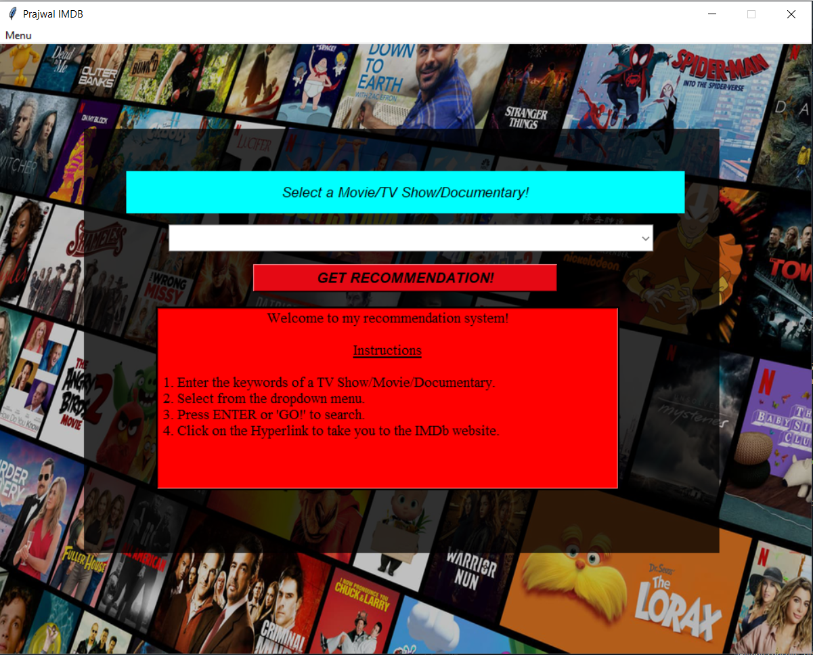
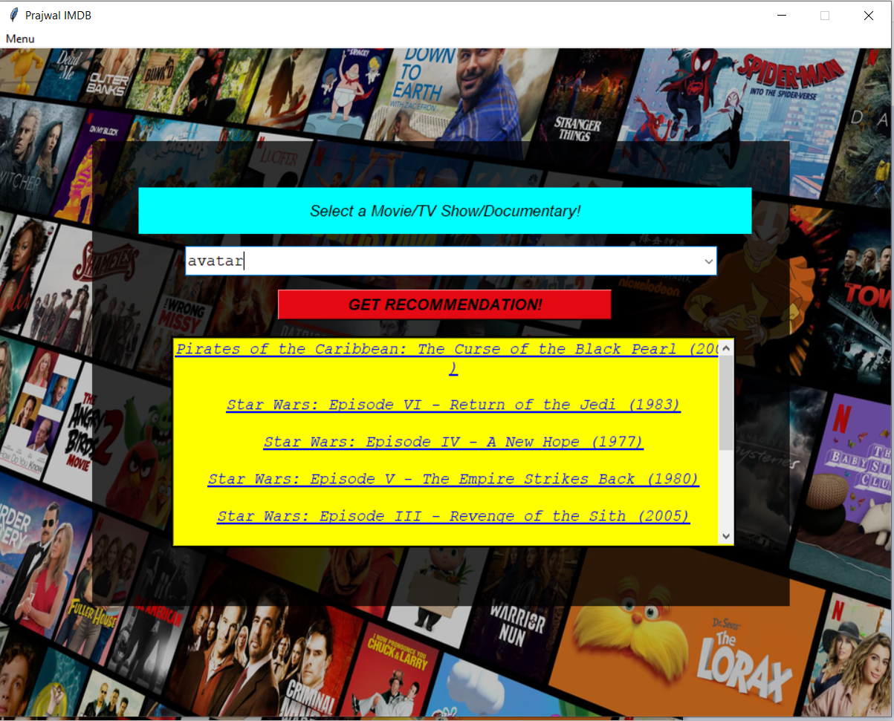

# Movie-Recommendation-System-Using-Cosine-Similarity
A machine learning model to recommend movies &amp; tv series.
This model is completely build in python using cosine similarity.
I can get recommendations for the movie or TV series name that I input and also if I click on those recommendation it'll redirect me to their respective IMDb webpages.

Libraries to install: 
Pygame
tkinter
webbrowser

